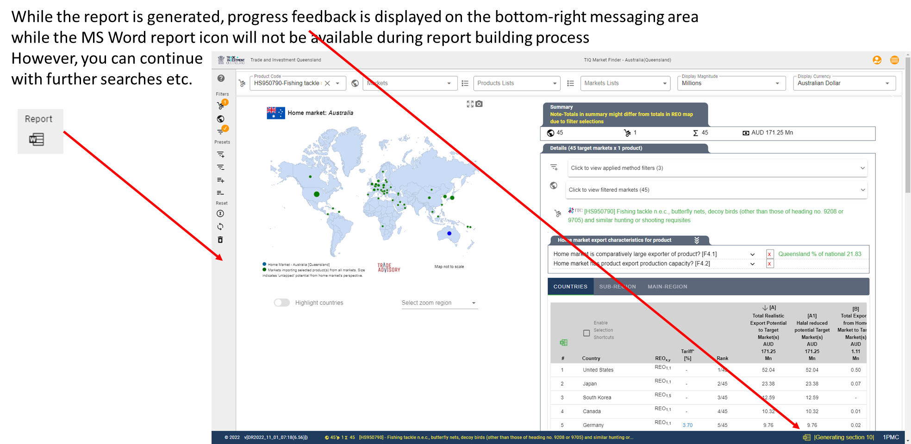

.. |location_NWU_Trade| raw:: html

   <a href="https://commerce.nwu.ac.za/TRADE" target="_blank">TRADE</a>

.. |location_ITC_HS_Codes| raw:: html

   <a href="https://www.trademap.org/stCorrespondingProductCodes.aspx?nvpm=1%7c%7c%7c%7c%7c%7c%7c%7c%7c%7c%7c%7c%7c%7c%7c%7c%7c" target="_blank">Harmonised System Correspondences</a>

Find an product code if it does not appear in the filtered results list?
************************************************************************

.. attention:: **Missing products or markets**

   Finding opportunities for a product in Export Market Finder where the product
   description or code “does not appear” in the default set of filtered results.

**Cause of the situation**

a) 'Missing' products or markets due to **active filters or selections**
    Export Market Finder works on the basis of applying filters and selections (e.g. products or countries) and then
    displaying the **resulting sub-set** of outcomes for the user to 'further' *drill into*.

    The fact that you there may face a situation where a product (or a market) *appears* not to have data or be available
    is typically a function of the fact that you have some active filters or selections that **EXCLUDE** this particular product or market
    from the available selection options.

    **Remedy**

    |How_to_Reset_Filters|

    The first recommended action is to **REMOVE** any potential filters / selections that may cause this to happen, then
    to try again to find the product or country. If you do find the item after removing all filters, it then makes sense
    to investigate and determine exactly which filter / sub-filter or action / selection caused the product or market to
    be excluded in order to assist you with the interpretation of the characteristics of the opportunity.

b) 'Missing' products due to HS tariff code revisions (new, old or not sufficient historical data)
    The data used in Export Market Finder currently makes use of the Harmonised System 2012 revision set of codes.
    However, since the HS 2012 revision, revisions HS 2017 and HS 2022 have been implemented.

    Unfortunately in the real operational world transactional systems take time to record and accumulate sufficient
    historical data for modelling purposes. In practice, when a new HS revision (like HS 2017 that was introduced
    globally in Jan 2017) is implemented, it can take up to 6-8 years for sufficient historical data to be collected
    on either new or changed codes. This means that for modelling purposes (since 6 years worth of data is required)
    the HS 2017 revision codes will only contain sufficient history to 'standardise' on this code set by 2023.

    The current commercially active HS code revision set is however HS 2022, so you may find that you are looking for
    a product code that was only created / introduced in the HS 2022 revision - meaning there will be no data available
    for historical trend analysis and modelling until around 2027 to 2028.

    A quick way to check if this may be the reason for you not finding a particular code is to make use of the
    International Trade Centre (ITC) TradeMap |location_ITC_HS_Codes| tool.

    |How_to_ITC_HS_check|

    As an illustrative example, the HS 2022 revision introduced a **new product code: 851713 for "Smartphones for wireless networks"**.
    Under the previous revisions (HS 2017 and further back) these products formed part of the definition of
    **old product code: 851712 for 'Telephones for cellular networks "mobile telephones" or for other wireless networks'**.

    Hence, if you enter the code HS851713 for the NEW tariff line, **you will not find any data for this product** - and will
    only be able to do so by around 2027 - 2028 !

    In this instance, you need to revert back to the older HS851712, which is a 'broader' definition of goods, but at least will contain data.

Step-by-step example to find an product code if it does not appear in the filtered results list?
************************************************************************************************
We provide and example for a case when looking for opportunities for a product in Export Market Finder
the product of interest “does not appear” in the default set of filtered results.

The example product:

**HS950790 Fishing tackle n.e.c., butterfly nets, decoy birds
(other than those of heading no. 9208 or 9705) and similar hunting or shooting requisites**

You can click on the step-images to enlarge (use browser back function to return to this point in the documentation).

|How_to_Missing_Product_Step_01|

|How_to_Missing_Product_Step_02|

|How_to_Missing_Product_Step_03_04|

|How_to_Missing_Product_Step_05|

|How_to_Missing_Product_Step_06|

|How_to_Missing_Product_Step_07|

|How_to_Missing_Product_Step_08|

|How_to_Missing_Product_Step_09|

|How_to_Missing_Product_Step_10|

|How_to_Missing_Product_Step_11|

If, after resetting and investigation whether the filters caused the "disappearance" of the product code, you find
that the code still do no appear, follow the International Trade Centre (ITC) TradeMap |location_ITC_HS_Codes| tool
investigation route.

If you still cannot find the product code, please contact us to assist.