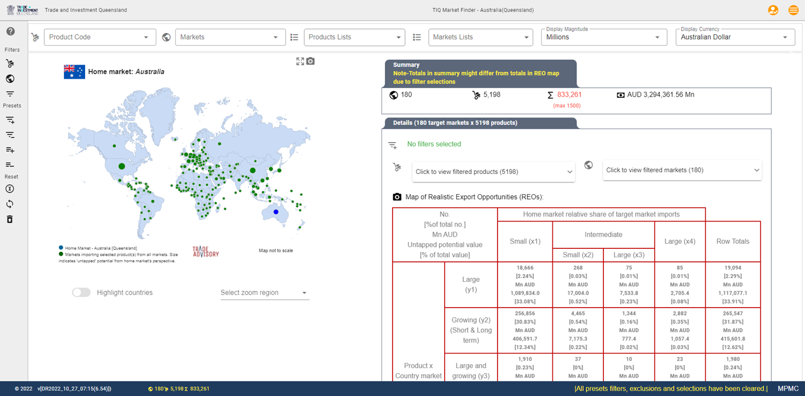
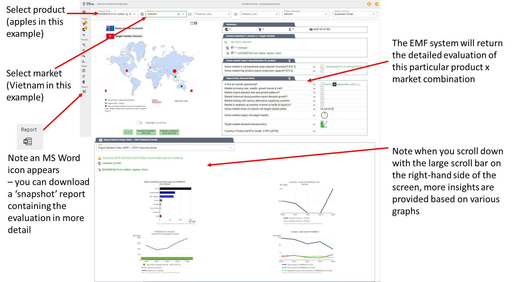
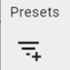
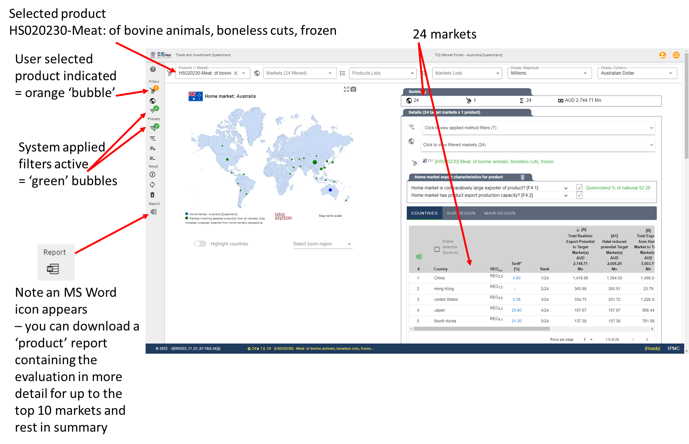
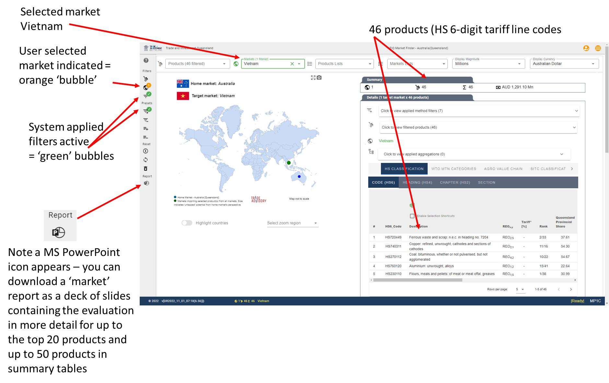

.. |location_NWU_Trade| raw:: html

   <a href="https://commerce.nwu.ac.za/TRADE" target="_blank">TRADE</a>

.. |Example_Filters_Apply| image:: ../images/Example_Filters_Apply.png
   :width: 70%
   :alt: EMF Example Default filters apply

The basics - how to use EMF online
**********************************

The **Export Market Finder (EMF)** platform has specifically been developed to assist trade and investment promotion professionals and government officials,
policy makers and analysts to quickly and effectively provide answers regarding realistic export opportunities.

.. note::
   A realistic export opportunity consists at the minimum of a single product (HS6 tariff line code) x market (country) combination.
   The evaluation and charcterisation of such a realistic export opportunity is based on a highly structured,
   scientifically based and repeatable framework referred to as the TRADE-DSM® methodology.

The TRADE-DSM® methodology (Decision Support Model) was developed in association with the TRADE research focus area and is a registered trademark of |location_NWU_Trade|, North-West University, South Africa.

See :ref:`RST Reading list` for some research papers and sources for the underlying methodology.

**EMF was specifically designed to - productively - answer three basic questions**

There are three (3) fundamental types of focus questions that forms the basis of any realistic export market potential analysis
- more complex questions and analysis can be constructed on top of these. These are:

•	:ref:`RST 1P1C` - the most basic question - what can I learn about the characteristics of a specific product (HS6 tariff line code) to a specific market?

\

•	:ref:`RST 1PMC` - which markets hold the most realistic 'untapped' potential for a specific product (HS6 tariff line code)?

\

•	:ref:`RST MP1C` which products (HS6 tariff line codes) are best evaluated for the most realistic 'untapped' potential for a specific selected target market?

Various variants of these basic questions can be constructed to answer further more strategic questions, or to focus on
e.g. specific sectors, master plans, trade blocs, regional value chains and other commercial and policy related analysis.

See section on strategy formulation topics for more detail.

**Quick overview of answering the three basic questions in the interface**

.. _RST 1P1C:

Single Product x Single Market focus
------------------------------------

For illustrative purposes we consider the export of apples (**HS080810-Fruit, edible: apples, fresh**) from Australia
to Vietnam.

In this example, since we have a pre-determined product (**apples**) and pre-determined potential target market (**Vietnam**)
to evaluate, there is **no need to apply any filters** in the EMF online interface.

|icon_Bin| **Step 1** - Ensure that no filters or other selections are currently active by clicking on the 'Bin' icon.

|Start_Sceen|

**Step 2** - Select the product and market as indicated.

|Example_1P1C|

.. ..TODO MC - need to add link to main method here later

More detail on the interpretation of outcomes for a particular product and market is provided in the method and interpretation section.

.. _RST 1PMC:

Single Product x Multiple Markets focus
---------------------------------------

For illustrative purposes we apply the *default* set of short-term export promotion filters for Australia.
We then select a particular product (**HS020230-Meat: of bovine animals, boneless cuts, frozen**), and view the resulting outcomes.

|icon_Bin| **Step 1** - Ensure that no filters or other selections are currently active by clicking on the '**Bin**' icon.

|Start_Sceen|

|icon_Default_Filters| **Step 2** - Select the '**load preset filters icon**'.

|Example_Filters_Apply|

**Step 3** - Select a particular product of interest that remains in the current filtered result set as
determined by the current active filter combinations.

As an illustrative example we select frozen beef (**HS020230-Meat: of bovine animals, boneless cuts, frozen**),
for which in this example 24 markets in total 'pass' the applied set of filters.

|Example_1PMC|

.. ..TODO MC - need to add link to main method here later

More detail on the interpretation of outcomes for a particular product and market is provided in the method and interpretation section.

.. _RST MP1C:

Single Market x Multiple Products focus
---------------------------------------

For illustrative purposes we apply the *default* set of short-term export promotion filters for Australia.
We then investigate a particular target market of interest, and view the resulting outcomes of the basket of
products that meet the selected set of *filters*' requirements. In this instance therefore the basket will contain
those products that are evaluated to be relatively 'mature' and export ready compared to the rest of the world.

|icon_Bin| **Step 1** - Ensure that no filters or other selections are currently active by clicking on the '**Bin**' icon.

|Start_Sceen|

|icon_Default_Filters| **Step 2** - Select the '**load preset filters icon**'.

|Example_Filters_Apply|

**Step 3** - Select a particular target market of interest that remains in the current filtered result set as
determined by the current active filter combinations.

As an illustrative example we select **Vietnam**, for which in this example 46 products in total 'pass' the applied set of filters.

|Example_MP1C|

.. ..TODO MC - need to add link to main method here later

More detail on the interpretation of outcomes for a particular product and market is provided in the method and interpretation section.
