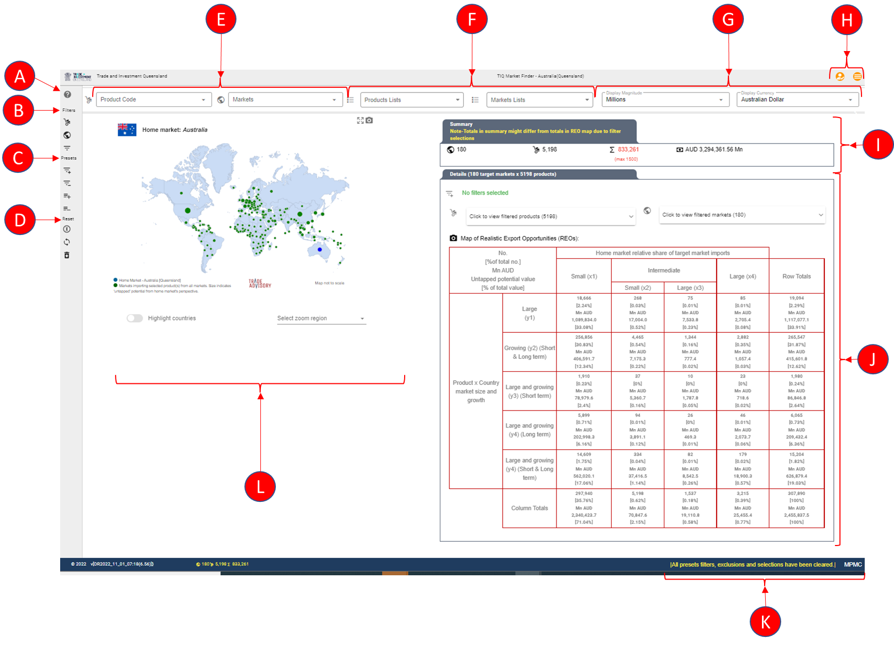

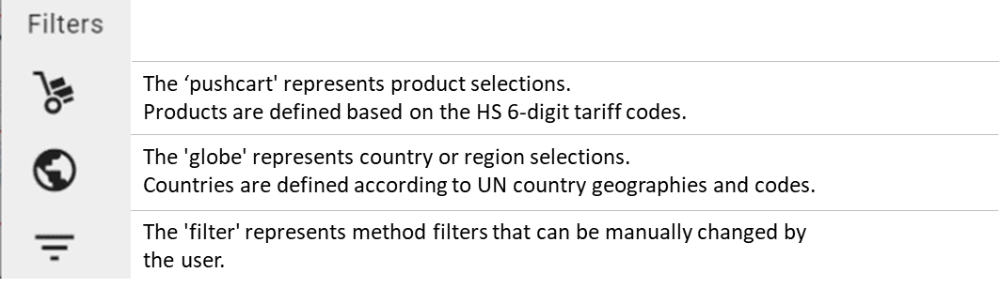

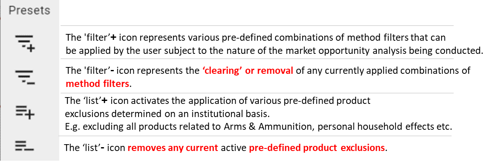

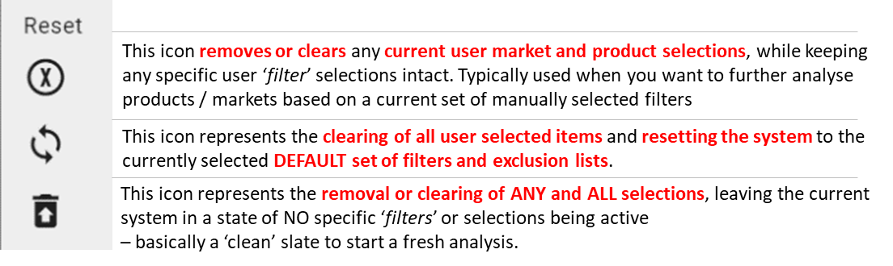

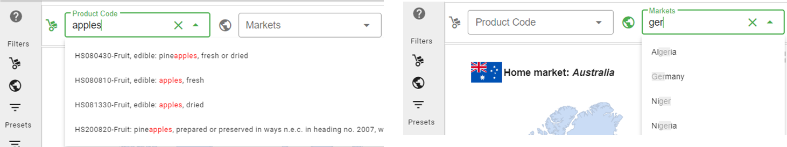

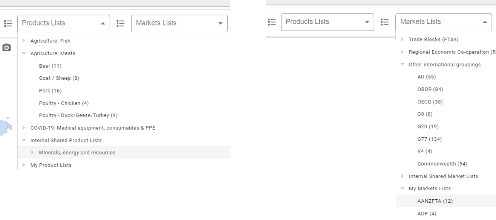

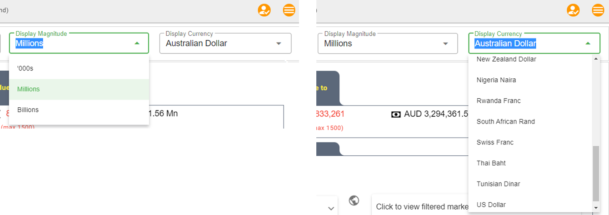

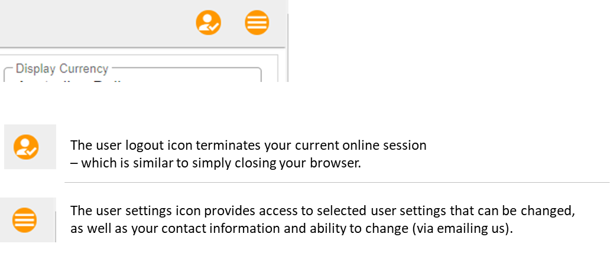

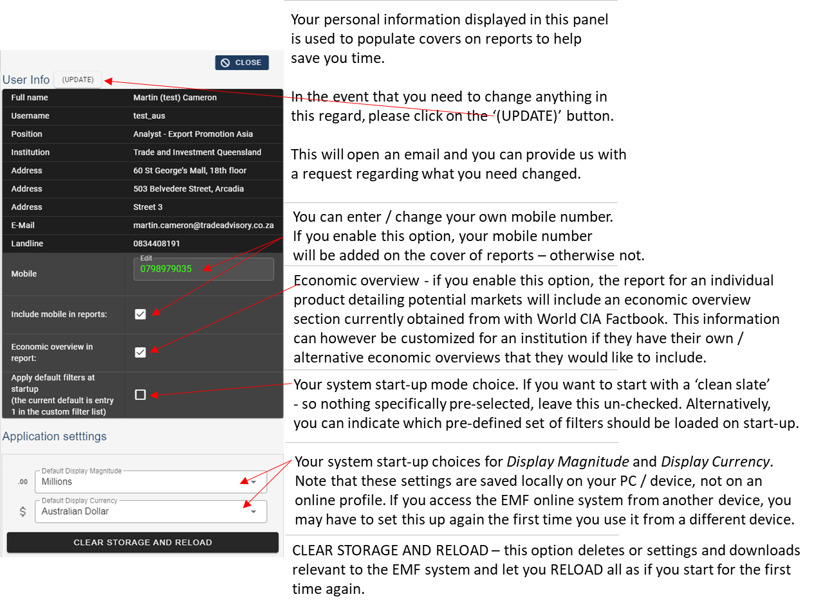

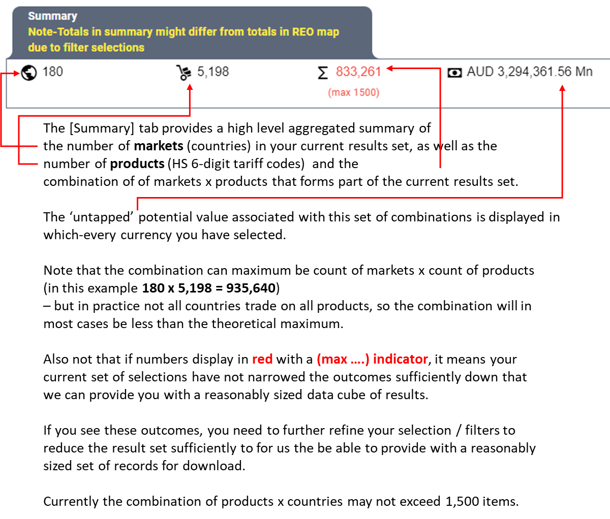

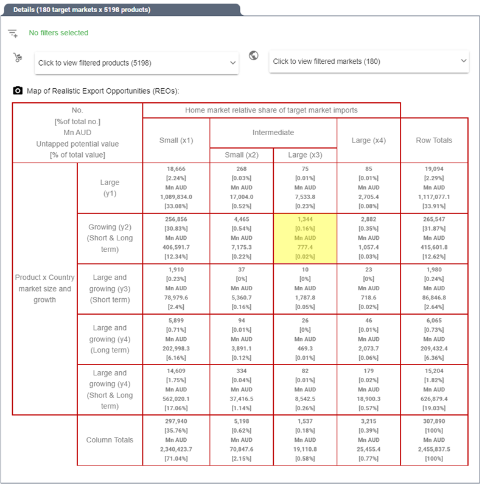

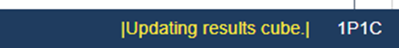

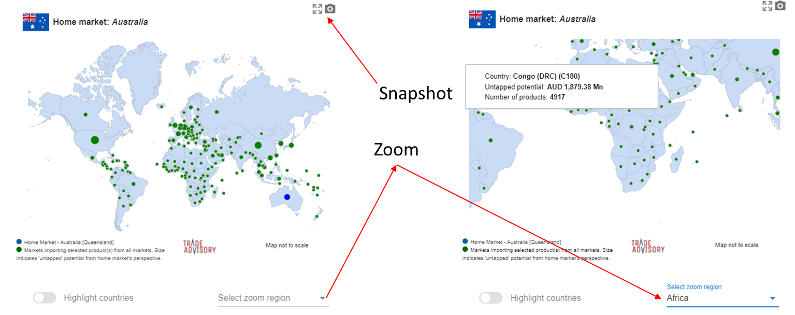

Basic screen layout explained
*****************************

The start-up screen contains 12 main areas (indicated by A to L in the image below) with different
functionality as described below in more detail for each area.

|Main_Screen_Layout|

[A] Help
========
|Main_Screen_Layout_Help|

[B] Filters (method)
====================
Filters allow the user to ‘sub select’ country and product combinations basedon explicit product or country selections,
or via methodological ‘filters’. The *Filters* area contains 3 icons.

|Main_Screen_Layout_Filters|

[C] Presets
===========
Presets are ‘short-cuts’ to apply pre-defined combinations of method filters, or variousproduct or market inclusions /
exclusions from the result sets. The *Presets* area contains 4 icons.

|Main_Screen_Layout_Presets|

[D] Reset
=========
Reset functions are ‘short-cuts’ to help the user to remove specific elements of current selections,
while maintaining certain other selections so as to prevent the user from having to ‘re-select’ specific elements.

|Main_Screen_Layout_Reset|

[E] Single selection lists (product or market)
==============================================
The single selection lists allow for the quick and convenient selection of a single product
(based on HS code or part of a description), or of that of a single market (country).
Once you have clicked on the item, the system will perform a query to retrieve the results of your selection.

|Main_Screen_Layout_Single_Selection|

You can also remove a current ‘single’ selection by clicking on the X to the right of the field selector (whether product or country / market).

[F] Selection lists for groups (products or markets)
====================================================
The Product and Market Lists are ‘pre-configured’ lists based on a grouping of HS codes (for products) or
countries (for markets). The purpose of these lists are to make it more productive for users to select a particular
group of products that they may work with regularly, or similar select a pre-defined group of countries (markets)
if they regularly focus on a select group of markets.

|Main_Screen_Layout_Screen_Product_Market_Lists|

Currently these lists contain ‘generalised’ groupings available to all users, but also allow for institutional
level groups  (visible only to users belonging to a subscribing institution) as well as personalized
(visible to an individual user only - so no one else can see these lists) sub-groupings or lists.

Currently users cannot yet add their own items to their own lists – this is a planned future functionality.

In the event that the institution would like to make available groups of products / countries across all users this
is possible via placing a request directly to us. The planned functionality for future would be to have an institutional
‘administrator’ user that can add / delete / edit lists on behalf of the users for an institution.

You can also remove a current  list selection by clicking on the X to the right of the field selector
(whether product or country / market lists).

[G] Magnitude and Currency selectors
====================================
The *Magnitude* and *Currency* selectors allow for quick changes of display magnitude of numbers in results
(on screen, in graphs and reports) as well as converting and displaying the currency (on screen, in graphs and reports).

|Main_Screen_Layout_Screen_Magnitude_Currency|

Note that any changes you make using these 2 options are TEMPORARY only.
Next time you log in, the system will set it back to the DEFAULT you have selected for these two functions.

To set your *default* currency (the currency you prefer the system to load whenever you log in) or magnitude indicator,
these settings can be changed under the User settings (see [H] below).

[H] User settings and log-out
=============================
The user settings icon provides access to selected user settings that can be changed,
as well as your contact information and ability to change (via emailing us).

|Main_Screen_Layout_Screen_User_Settings|

|Main_Screen_Layout_Screen_User_Settings_Box|

[I] Results tab - high level summary
====================================

|Main_Screen_Layout_Screen_Summary_Tab|

[J] Realistic Export Opportunities (REOs) Map
=============================================
The **Realistic Export Opportunities (REOs) Map** area displays the current set of combinations
in the active result set categorized based on the TRADE-DSM® identified opportunities' strategic classification framework.

|Main_Screen_Layout_REO_Map|

Note that individual ‘cells’ or blocks can be selected – when moving your mouse over
the block it will **highlight in yellow**.

If you want to select or ‘drill’ into the combinations of products and markets contained in a
particular classification group, you can simply click on the cell of interest. This will instruct the system to extract the set of products and markets that underlies
this summary set of outcomes as displayed in the selected cell.

Note that if you click on a cell in the **Column Totals** row – this will instruct the system to
extract the whole column, and similar for a **Row Totals** column cell.

[K] Reporting compiling messaging / feedback area
=================================================

|Main_Screen_Layout_Messaging| The bottom-right corner of the screen will display process messaging while the
system is working on your requests – whether for data cubes or building / populating reports.

[L] Geographic map visual feedback area
=======================================
The geographic map visual feedback area provides a view of the current outcomes related to different markets across the world.
Note the purpose of this representation is not to be geographically to scale, but simply serves as a spatial orientation view of the information.

|Main_Screen_Layout_Geo_Map|

You can Zoom into more detail per geographic (continental) region by changing the **zoom region**.

You can also see summary outcomes (‘untapped’ potential value & number of products) for a particular
market of interested by ‘hovering’ your mouse cursor over the relevant ‘bubble’ for a country.

Note you can also **select a particular country** by  clicking on the relevant representative country  ‘bubble’.

Lastly, you can take a quick ‘snapshot’ image of the map and current displayed information for using in
e.g. PowerPoint, MS Word or any similar purpose.