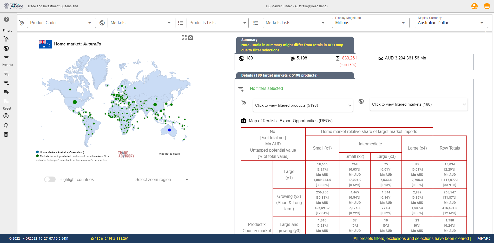

.. include:: _includefiles/default.txt
.. ..include:: _includefiles/client_australia_TIQ.txt
.. ..:width: 200

.. .. Code starts

.. |location_NWU_Trade| raw:: html

   <a href="https://commerce.nwu.ac.za/TRADE" target="_blank">TRADE</a>

.. |location_WCO| raw:: html

   <a href="http://www.wcoomd.org/" target="_blank">World Customs Organisation (WCO)</a>

Export Market Finder
####################

.. note::
   Please note that this knowledge resource is still in development and will be expanded on an ongoing basis.
   If there is a particular aspect that you require assistance with and it is not populate yet, please contact us to prioritise.
   Your understanding is appreciated.

.. centered:: |TA_Logo|

.. raw:: html

   <h1 style="text-align: center;">EXPORT MARKET FINDER (EMF)</h1>

.. ..Next section use switches for custom text per client / market

.. raw:: html

   <h3 style="text-align: center;">Customised version for </h3>

.. ..Comment  <h3 style="text-align: center;">

.. ..Next section = Standard

.. raw:: html

   <h3>What is Export Market Finder?</h3>

.. ..Next section = Standard

Trade Advisory's **Export Market Finder** is an export decision-making application that assists with the identification of products and markets with realistic shorter-term ‘untapped’ export potential as well as opportunities for export market diversification.

With data for >180 markets (countries) and >5,000 products (tariff codes, defined by the |location_WCO| it provides detailed and practical information for trade professionals, officials, advisors and policymakers around the world.

.. note::
   A realistic export opportunity consists at the minimum of a single product (HS6 tariff line code) x market (country) combination.
   The evaluation and charcterisation of such a realistic export opportunity is based on a highly structured,
   scientifically based and repeatable framework referred to as the TRADE-DSM® methodology.

The TRADE-DSM® methodology (Decision Support Model) was developed in association with the TRADE research focus area and is a registered trademark of |location_NWU_Trade|, North-West University, South Africa.

.. Next section use switches for custom text per client / market

The tool operates across a number of different typical trade and promotion functions assisting |TargetClient| within different areas of focus.

.. .. centered:: |Main_Screen|

.. raw:: html

   <h3 style="text-align: center;"></h3>

.. ..Next section = Standard

Export promotion, development and investment questions can be informed from:

  * **a product perspective**

    - to assess an opportunity for a product to a particular market

    - to assess opportunities for a group of products (for example tailored to a sector/ industry) to a specific market and/ or

    - to assess an opportunity for a product/ group of products to multiple markets.

\

  * **a market perspective**

    - to assess a market in terms of a potential basket of realistic opportunities (products) for a selected market.

    - to assess across a group (region, trade bloc) of markets a potential basket of realistic opportunities (products).

.. ..Next section = Standard

.. toctree::
   :name: mastertoc
   :caption: Getting started ...

   chapters/EMF_Screen_Layout.rst
   chapters/EMF_Online_Intro.rst

.. toctree::
   :name: howtotoc
   :caption: How do I? ...

   chapters/EMF_How_do_I.rst

.. toctree::
   :name: methodtoc
   :caption: I want to know more about ...

   chapters/EMF_FAQs.rst

.. toctree::
   :name: referencestoc
   :titlesonly:
   :caption: References

   chapters/abbreviations.rst
   chapters/Reading_List.rst

