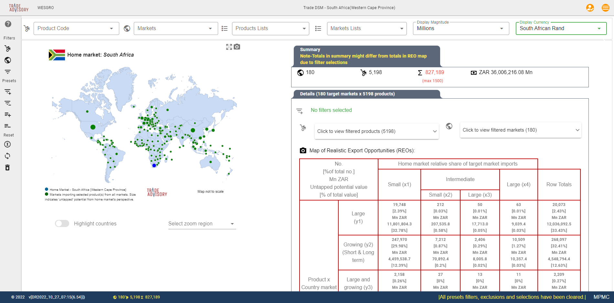

.. include:: _includefiles/default.txt
.. ..include:: _includefiles/client_australia_TIQ.txt

.. .. Code starts

.. |Company_Logo| image:: images/Company_Logo.png
   :width: 200
   :alt: Trade Advisory

...
============

.. centered:: |TA_Logo|

.. raw:: html

   <h1 style="text-align: center;">EXPORT MARKET FINDER</h1>

.. Next section use switches for custom text per client / market
.. todo - used australia for test for default - will be changed to TA
.. todo Add logos in images folder (AEXI, BITC, DALRRD, DTIC, Ethekwini, Mpumalanga, Infometrics, North West Province, TIKZN, WESGRO

.. raw:: html

   <h3 style="text-align: center;">Customised version for </h3>

.. toctree::
   :titlesonly:
   :name: mastertoc
   :caption: Getting started ...

   chapters/EMF_Screen_Layout
   chapters/EMF_Online_Intro
   chapters/EMF_FAQs

.. toctree::
   :titlesonly:
   :name: methodtoc
   :caption: I want to know more about ...

   chapters/EMF_Method_Overview.rst
   chapters/EMF_Filters_Overview
   chapters/EMF_Case_Studies

.. toctree::
   :titlesonly:
   :name: advancedtoc
   :caption: Strategy formulation topics ...

   chapters/EMF_Export_Promotion_Strategies
   chapters/EMF_Export_Strategy_Formulation.rst

.. toctree::
   :titlesonly:
   :name: referencestoc
   :caption: References

   chapters/abbreviations
   chapters/Reading_List

.. Next section = Standard

====

.. raw:: html

   <h3>What is Export Market Finder?</h3>

Trade Advisory's **Export Market Finder** is an export decision-making application that assist with the identification of products and markets with realistic shorter-term ‘untapped’ export potential as well as opportunities for export market diversification.

With data for >180 markets (countries) and >5,000 products (tariff codes), it provides detailed and practical information for trade advisers and policymakers around the world.

.. Next section use switches for custom text per client / market

The tool operates across a number of functions but the new online version makes it simpler to assist |TargetClient|.

.. centered:: |Main_Screen|

.. Next section = Standard

**Export promotion, development and investment questions can be informed from:**

  * a product perspective
        \- to assess an opportunity for a product to a market

        \- to assess opportunities for a group of products (for example tailored to a sector/ industry) to a market and/ or

        \- to assess an opportunity for a product/ group of products to multiple markets.

  * a market perspective
        \- to assess a market in terms of a potential basket of realistic opportunities (products) for a selected market.

        \- to assess across a group (region, trade bloc) of markets a potential basket of realistic opportunities (products).

